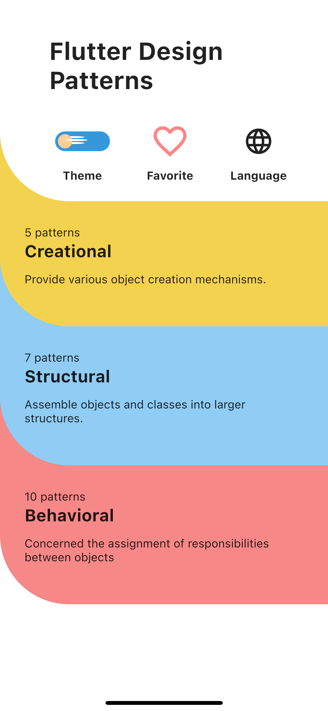
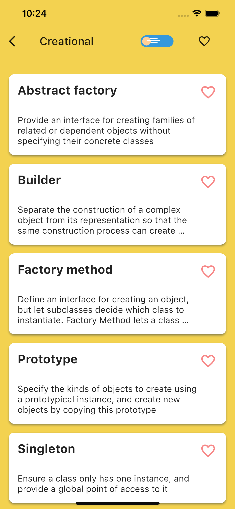
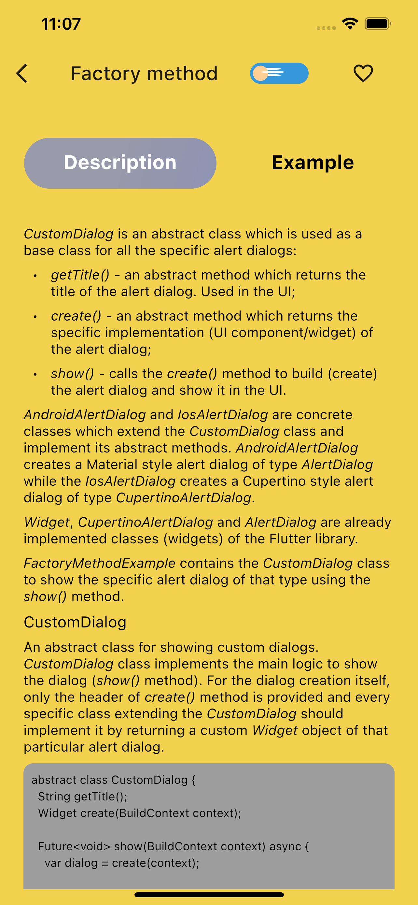
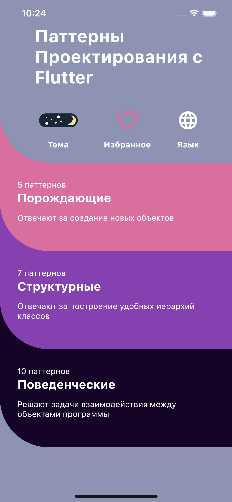
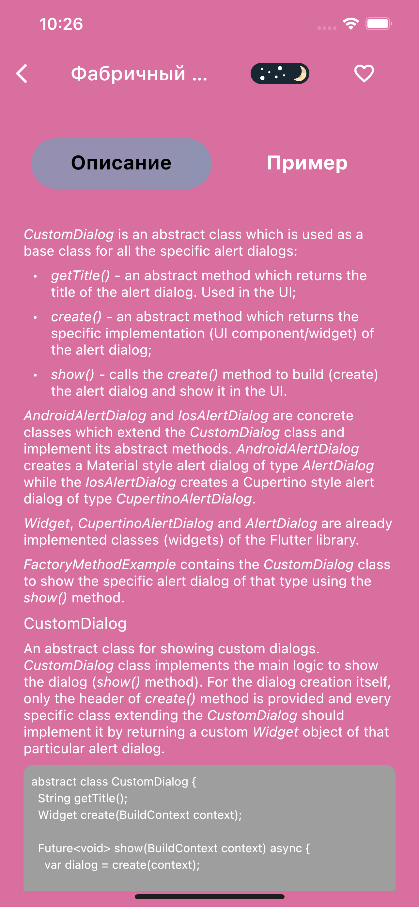

# Flutter Design Patterns
An application which realized design patterns with Dart and Flutter

## Table of contents
* [General info](#general-info)
* [Setup](#setup)
* [License information](#license-information)
* [Contributors](#contributors)


## General info
This application was built for three reasons:

**1. The most important is that I needed to learn design patterns**

**2. For easy and quick access to information about patterns**

**3. In order to inspire other people learn design patterns**

#### Screenshots:

<p float="left">
	
	
	
	
    
	
</p>

## Setup

### From IDE

Just clone or download the project from GitHub and run it from your IDE. How to start with Flutter on your IDE search [here](https://flutter.dev/docs/get-started/editor).

### Without IDE

You can build the app for Android from terminal on your machine without installing any IDE. Follow this steps:

1. install [Flutter](https://flutter.dev/docs/get-started/install) and dependencies for it;
2. in terminal change current directory (by command `cd`) to the `android` folder in the project and run:

```shell
flutter pub run build_runner build
flutter build apk --profile --split-per-abi
```

3. find created `.apk` at `/build/app/outputs/flutter-apk/app-profile.apk`.

## How to build app for iOS

### From IDE

Just clone or download the project from GitHub and run it from your IDE. How to start with Flutter search [here](https://flutter.dev/docs/get-started/editor).

## License information
This repository includes files originally and partially copied from `https://github.com/mkobuolys/flutter-design-patterns` under `flutter_design_patterns_app/assets/markdown/` and `flutter_design_patterns_app/lib/ui/pattern_widgets/`:

* `abstract_factory.md`
* `adapter.md`
* `bridge.md`
* `bridge.md`
* `chain_of_responsibility.md`
* `command.md`
* `composite.md`
* `decorator.md`
* `facade.md`
* `factory_method.md`
* `flyweight.md`
* `iterator.md`
* `mediator.md`
* `memento.md`
* `observer.md`
* `prototype.md`
* `proxy.md`
* `singleton.md`
* `state.md`
* `strategy.md`
* `template_method.md`
* `visitor.md`

* `cupertino_widgets_factory.dart`
* `material_widgets_factory.dart`
* `android_switch.dart`
* `android_indicator.dart`
* `android_slider.dart`
* `ios_switch.dart`
* `ios_indicator.dart`
* `ios_slider.dart`
* `abstract_factory_pattern_widgtet.dart`
* `factory_selection.dart`
* `i_indicator.dart`
* `i_platform_widgets_factory.dart`
* `i_slider.dart`
* `i_switch.dart`
* `i_contacts_adapter.dart`
* `json_contacts_adapter.dart`
* `xml_contacts_adapter.dart`
* `json_contacts_api.dart`
* `xml_contacts_api.dart`
* `adapter_pattern_widget.dart`
* `contact_item.dart`
* `contacts_section.dart`
* `contacts_section_content.dart`
* `contact.dart`
* `customer.dart`
* `entity_base.dart`
* `order.dart`
* `customer_repository.dart`
* `order_repository.dart`
* `file_storage.dart`
* `sql_storage.dart`
* `customers_data_table.dart`
* `orders_data_table.dart`
* `bridge_pattern_widget.dart`
* `storage_section.dart`
* `i_repository.dart`
* `i_storage.dart`
* `json_helper.dart`
* `builder_information_column.dart`
* `builder_pattern_widget.dart`
* `builder_information_label.dart`
* `burger_drop_down_item.dart`
* `big_mac_builder.dart`
* `burger_builders_import.dart`
* `cheeseburger_builder.dart`
* `hamburger_builder.dart`
* `mc_chicken_builder.dart`
* `big_mac_bun.dart`
* `regular_bun.dart`
* `beef_patty.dart`
* `mc_chicken_patty.dart`
* `big_mac_sauce.dart`
* `ketchup.dart`
* `mayonnaise.dart`
* `mustard.dart`
* `onion.dart`
* `pickle_slices.dart`
* `shredded_letuce.dart`
* `cheese.dart`
* `grill_seasoning.dart`
* `ingredient.dart`
* `ingredients_imports.dart`
* `burger.dart`
* `burger_builder.dart`
* `burger_maker.dart`
* `base_logger.dart`
* `debug_logger.dart`
* `error_logger.dart`
* `info_logger.dart`
* `external_logging_service.dart`
* `mail_service.dart`
* `chain_of_responsibility_pattern_widget.dart`
* `log_messages_column.dart`
* `log_bloc.dart`
* `log_level.dart`
* `log_message.dart`
* `change_color_command.dart`
* `change_height_command.dart`
* `chande_width_command.dart`
* `i_command.dart`
* `command_history_column.dart`
* `command_pattern_widget.dart`
* `shape_container.dart`
* `command_history.dart`
* `shape.dart`
* `audio_file.dart`
* `directory.dart`
* `file.dart`
* `image_file.dart`
* `text_file.dart`
* `video_file.dart`
* `composite_pattern_widget.dart`
* `file_size_converter.dart`
* `i_file.dart`
* `basil.dart`
* `mozzarella.dart`
* `olive_oil.dart`
* `oregano.dart`
* `pecorino.dart`
* `pepperoni.dart`
* `sauce.dart`
* `custom_pizza_selection_widget.dart`
* `decorator_pattern_widget.dart`
* `pizza_information_widget.dart`
* `pizza_selection_widget.dart`
* `pizza.dart`
* `pizza_base.dart`
* `pizza_decorator.dart`
* `pizza_menu.dart`
* `pizza_topping_data.dart`
* `audio_api.dart`
* `camera_api.dart`
* `netfliz_api.dart`
* `playstation_api.dart`
* `smart_home_api.dart`
* `tv_api.dart`
* `gaming_facade.dart`
* `smarthome_facade.dart`
* `device_icon.dart`
* `facade_pattern_widget.dart`
* `mode_switcher.dart`
* `smart_home_state.dart`
* `android_alert_dialog.dart`
* `ios_alert_dialog.dart`
* `dialog_selection_widget.dart`
* `factory_mehtod_pattern_widget.dart`
* `custom_alert_dialog.dart`
* `circle.dart`
* `i_positioned_shape.dart`
* `square.dart`
* `flyweight_pattern_widget.dart`
* `positioned_shape_wrapper.dart`
* `shape_factory.dart`
* `shape_flyweight_factory.dart`
* `shape_type.dart`
* `breadth_first_tree_collection.dart`
* `depth_first_tree_collection.dart`
* `i_tree_collection.dart`
* `breadth_first_tree_iterator.dart`
* `depth_first_tree_iterator.dart`
* `i_tree_iterator.dart`
* `box.dart`
* `iterator_pattern_widget.dart`
* `tree_collection_selection.dart`
* `graph.dart`
* `notification_hub.dart`
* `team_notification_hub.dart`
* `admin.dart`
* `developer.dart`
* `team_member.dart`
* `tester.dart`
* `mediator_pattern_widget.dart`
* `notification_list.dart`
* `randomise_properties_commund.dart`
* `i_memento.dart`
* `memento.dart`
* `memento_pattern_widget.dart`
* `originator.dart`
* `shape.dart`
* `shape_container.dart`
* `default_stock_subscriber.dart`
* `growing_stock_subscriber.dart`
* `stock_subscriber.dart`
* `game_stock_ticker.dart`
* `google_stock_ticker.dart`
* `stock_ticker.dart`
* `tesla_stock_ticker.dart`
* `observer_pattern_widget.dart`
* `stock_row.dart`
* `stock_subscriber_selection.dart`
* `stock_ticker_selection.dart`
* `stock.dart`
* `stock_ticker_model.dart`
* `stock_ticker_symbol.dart`
* `circle.dart`
* `rectangle.dart`
* `shape.dart`
* `prototype_pattern_widget.dart`
* `shape_column.dart`
* `sized_shape_column.dart`
* `customer.dart`
* `customer_details.dart`
* `customer_details_column.dart`
* `customer_details_dialog.dart`
* `customer_info_group.dart`
* `proxy_pattern_widget.dart`
* `customer_details_service.dart`
* `customer_details_service_proxy.dart`
* `i_customer_details_service.dart`
* `state_base.dart`
* `state_singleton_by_definition.dart`
* `state_singleton_factory.dart`
* `state_without_singleton.dart`
* `state_card_widget.dart`
* `error_state.dart`
* `loaded_state.dart`
* `loading_state.dart`
* `no_results_state.dart`
* `state_pattern_widget.dart`
* `fake_api.dart`
* `i_state.dart`
* `state_context.dart`
* `order.dart`
* `order_item.dart`
* `package_size.dart`
* `package_size.dart`
* `in_store_pickup_strategy.dart`
* `parcel_terminal_shipping_strategy.dart`
* `priority_shipping_strategy.dart`
* `order_items_table.dart`
* `order_summary.dart`
* `order_summary_row.dart`
* `shipping_options.dart`
* `shipping_options.dart`
* `strategy_pattern_widget.dart`
* `i_shipping_costs_strategy.dart`
* `json_students_api.dart`
* `xml_students_api.dart`
* `students_json_bmi_calculator.dart`
* `students_xml_bmi_calculator.dart`
* `teenage_students_json_bmi_calculator.dart`
* `students_datatable.dart`
* `students_section.dart`
* `template_method_patten_widget.dart`
* `student.dart`
* `student_bmi_calculator.dart`
* `directory.dart`
* `file.dart`
* `audio_file.dart`
* `image_file.dart`
* `text_file.dart`
* `video_file.dart`
* `human_readable_visitor.dart`
* `xml_visitor.dart`
* `files_dialog.dart`
* `files_visitor_selection.dart`
* `visitor_pattern_widget.dart`
* `formatting_extension.dart`
* `i_file.dart`
* `i_visitor.dart`


Original versions of the files are MIT licensed. See the file headers for details.

## Contributors:

* [@GeorgeOblomov](https://github.com/GeorgeOblomov) as Egor Grischenkov